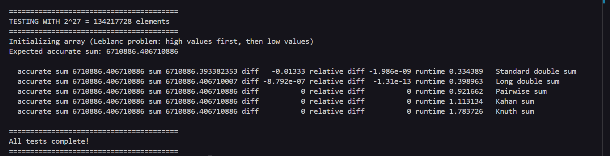

## Week 5 - Parallel algorithms and patterns 

### Overview 
The purpose of this project is to test different methods used for summing numbers in order to solve the global sum problem in parallel programming.

### The global sum problem
### Why does it happen? 
Because when you change the order of additions in parallel computing, you will get varying results. This happens due to multiple processors working together, which makes the order of additions change. 

### Why does it matter? 
The same input should always generate the same output. Without that, we simply cannot trust the results we got, because there is no way to verify what is actually correct. Also, floating point arithmetic operations are not associative. That means that (a+b)+c is not the same as a+(b+c). This is actually what causes different result each time. Researches cannot trust results that change every time. 

### Impact on parallel programming
The global sum problem affects parallel computing in several different ways:
1) When the same calculation runs on different number of processors, we get different results. We can't really be sure what is right and what's not.
2) Programmers face significant issues when debugging. They cannot tell apart regular parallelization bugs from numerical instability. 
3) Scientific codes can't be validated against serial reference implementations because the results vary.
4) The same program may produce different results when using different hardware components (like GPUs and CPUs), or even when we are dealing with a different number of threads. 
- By using enhanced precision algorithms, we can solve all of these issues. We make sure that the summation is associative, preventing the changes of the final result.  

## Implemented algorithms
### Standard double sum
- Numbers are added one after another
- Very simple
- It accumulates large errors because of the computer handling decimal numbers
- As mentioned above, we have the problem of getting different outputs because numbers are added in different orders
- It processes each number once, which is fast but still unreliable due to varying results
- When we tested it we got the error of -0.01333 when dealing with 134 million elements 

### Long double data type 
- Here we are using more numbers with more decimal places
- That way we are making sure the accuracy is higher
- The errors are smaller with this approach, but they are still evident
- We are still processing one number at a time, which makes it fast
- When we tested it, the errors were smaller, but they were still there

### Pairwise summation
- We are adding numbers in pairs, then adding those results in pairs
- We achieved perfect accuracy with 0% error rate
- We do need extra memory, thought
- This structure is naturally parallelizable
- The complexity is O(N)
- Therefore, everything works perfectly and we have zero errors 

### Kahan summation
- Zero errors
- It has good accuracy to performance ratio 
- Very easy to implement
- Also easy to parallelize 
- The complexity is O(N)

### Knuth summation
- Can handle cases where either term can be larger
- Perfect precision again with zero errors
- Gets more complex w/ 7 OPs per element

### Results of the analysis
- Enhanced precision algorithms get perfect results using several techniques:
1) By increasing effective precision - Kahan and Knuth use correction terms
2) By maintaining numerical stability - Pairwise uses hierarchical summation
3) By preserving digits lost by summing the standard way
4) By restoring associativity through precision enhancement

### Performance comparison
1) Standard double is by far the fastest, but not accurate at all
2) Long double is slightly slower with reduced errors, but they are still there so it is not the best 
3) Pairwise is moderately fast, but accuracy is perfect
4) Kahan is well balanced, perfect accuracy
5) Knuth is the slowest, perfect accuracy  

### Code implementation and testing
- In this project we are implementing and testing five different summation algorithms
- Everything is implemented using C
- We are using same function signatures to ensure fair comparison 
- The code tests methods on arrays ranging from 1024 to 134 million elements
- We are using the Leblanc problem pattern:
1) half high values (1.0e-1)
2) half low values (1.0e-10)
- We are measuring execution time with high res timers in order to compare performance 
- We are comparing precision using mathematically accurate expected results
- When it comes to testing, we have several points to make:
1) each algorithm processes the same data in order to ensure that everything is fair
2) absolute and relative errors are both calculated
3) we are testing with different problem sizes to show how everything is scaling 

### Note: compiler compatibility 
The restrict keyword was used for compiler optimization, but it was not compatible on my device, so i implemented a simple fix: 
#ifndef restrict
#ifdef __GNUC__
#define restrict __restrict__
#else
#define restrict
#endif
#endif

### Terminal output screenshot

### Google sheets link
https://docs.google.com/spreadsheets/d/1HMnD6RjgQhv6Dz_0hFG4s3RPFD_r0lK58Xwm3Ieel04/edit?usp=sharing