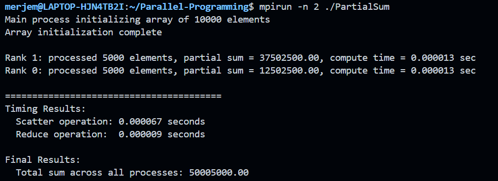
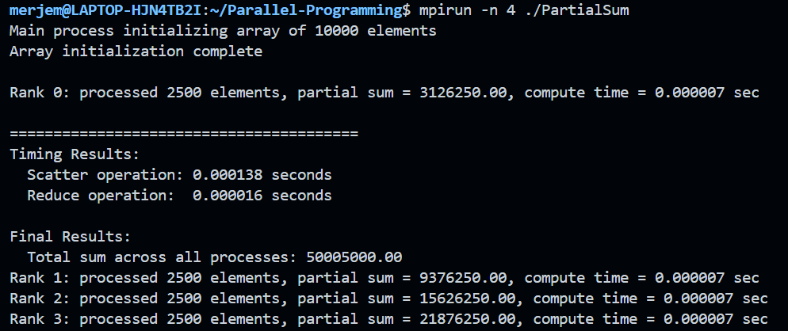
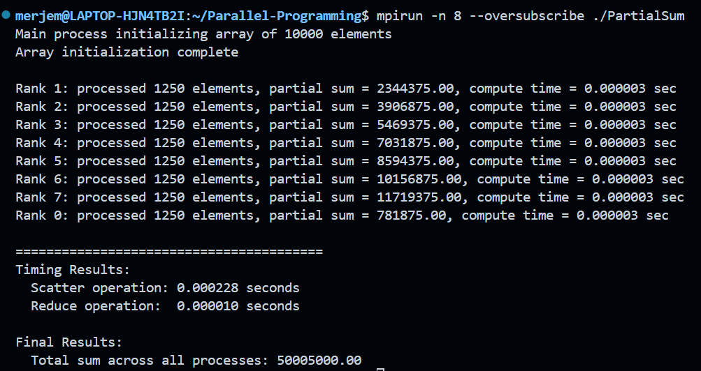

# Assignment 7

## Purpose of the program
MPI collective communication calls are used in order to calculate the sum of a large array using multiple processes. 

## Implementation
The program utilizes the following MPI collective operations:
1) MPI_Allgather - every process shares its chunk size with every other process. This way we are sure that every proccess knows how many elements each process will get during the scatter operation 
2) MPI_Scatterv - rank 0 (aka the root process) is distributing variable-sized chunks of the array to every other process
3) MPI_Reduce - all sums are combined into one result using MPI_SUM

## Code explanation
### Key components
- We are dividing the array using integer division:
``` c
long ibegin = ncells * rank / nprocs;
long iend = ncells * (rank + 1) / nprocs;
int nsize = (int)(iend - ibegin);
```
- Each process calculates sum of the local chunk
- MPI_Reduce combines all sums into one final result 

### MPI functions 
```c
MPI_Allgather(&nsize, 1, MPI_INT, nsizes, 1, MPI_INT, comm);
MPI_Scatterv(a_global, nsizes, offsets, MPI_DOUBLE, a_local, nsize, MPI_DOUBLE, 0, comm);
MPI_Reduce(&local_sum, &total_sum, 1, MPI_DOUBLE, MPI_SUM, 0, comm);
 ```

 ### Why use MPI_Scatterv? 
- MPI_Scatterv is used instead of the regular MPI_Scatter
- Why? Because it can handle when the array cannot be perfectly divided by the number of processes 
- Our 10,000 element array is divisible by 2, 4, and 8, but this approach provides more flexibility

### How does it work? 
- MPI_Scatterv takes a large array from rank 0
- Then it divides it into chunks based on the `nsizes` array
- After that, it sends each chunk to its correct process by using the `offsets` array
- Each process gets its chunk into its local array

### Parameters
- `a_global` - is the source array on rank 0
- `nsizes` - array that tells how many elements can each process get
- `offsets` - an array that has indices in the source array for each process
- `a_local` - destination buffer for each process

## Memory management explanation
Why only rank 0 needs to deallocate the global array resources? 
```c
if (rank == 0) {
    free(a_global);
}
 ```
Only rank 0 needs `a_global` because rank 0 only allocated it to begin with. Memory allocation for `a_global` happens inside conditional blocks for rank 0:
```c 
if (rank == 0) {
    a_global = (double *)malloc(ncells * sizeof(double));
    // ... the rest of the code ...
}
```
Other processes don't allocate `a_global`, because if they tried it would cause a segmentation fault.

## Results
### 2 processes 

- 5000 elements per process
- Compute time: 0.000013 seconds
- Scatter time: 0.000067 seconds
- Total sum: 50,005,000.00

### 4 processes

- 2500 elements per process
- Compute time: 0.000007 seconds
- Scatter time: 0.000138 seconds
- Total sum: 50,005,000.00

### 8 processes (w/ --oversubscribe)

- 1250 elements per process
- Compute time: 0.000003 seconds
- Scatter time: 0.000228 seconds
- Total sum: 50,005,000.00

## Performance analysis
- Computational time decreases as work gets distributed (0.000013s -> 0.000007s -> 0.000003s)
- Computation time increases with more processes
- All runs produce the same output (50,005,000.00)

## Technical notes 
- In order to run 8 processes, I had to use the `--oversubscribe` flag due to hardware limitations (4-core processor)
- Had to implement `#define _POSIX_C_SOURCE 199309L` in timer.c to be able to use `CLOCK_MONOTONIC`

## VS Code config note 
I had some include path errors in the editor, so I had to modify the `c_cpp_properties.json` file. 
This allowed my IDE to locate the MPI headers, which it couldn't do previously, and resolve syntax highlighting issues. 