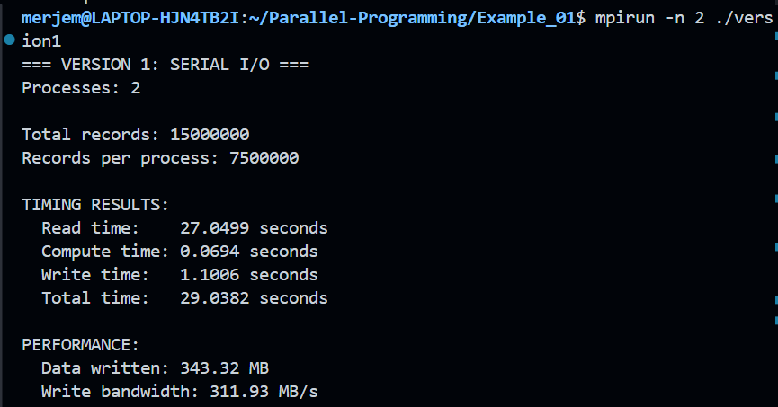
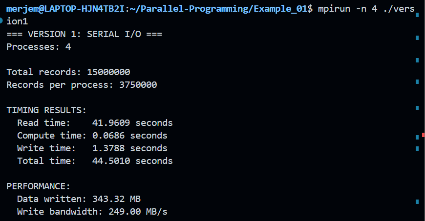
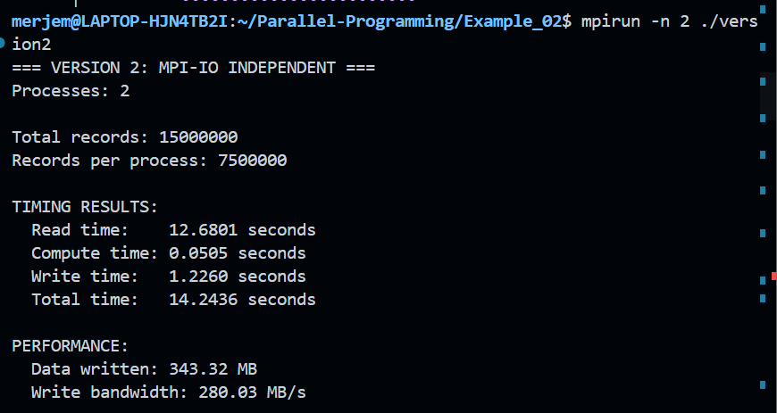
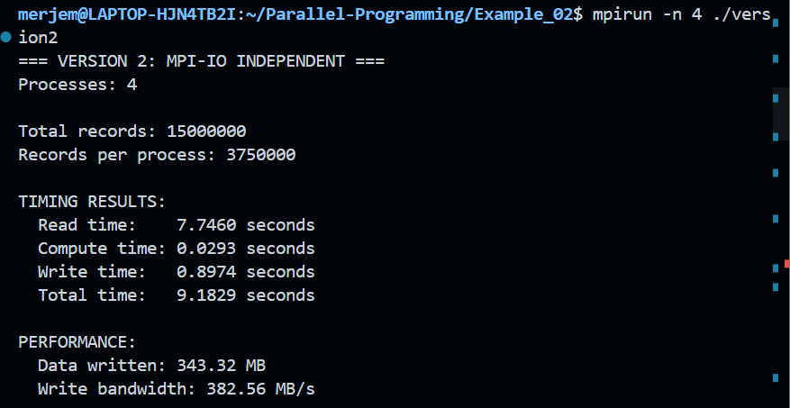
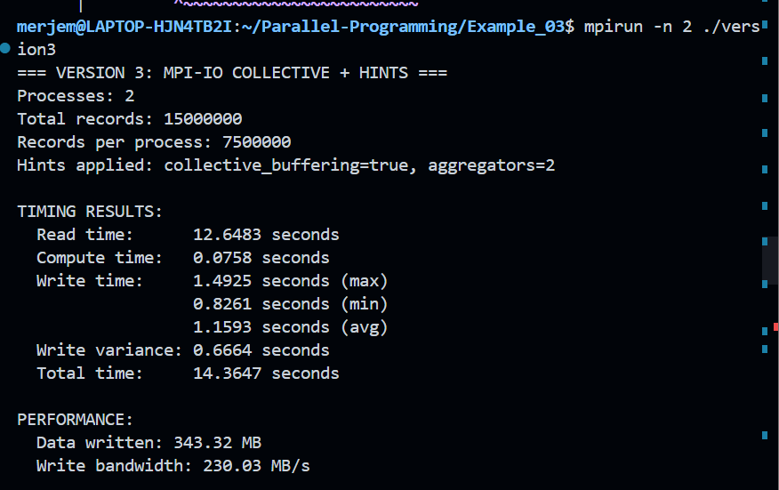
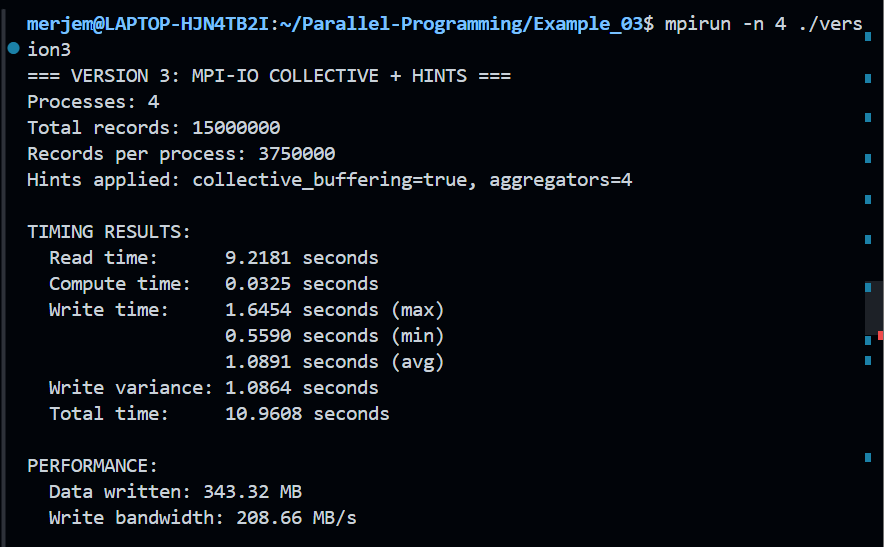
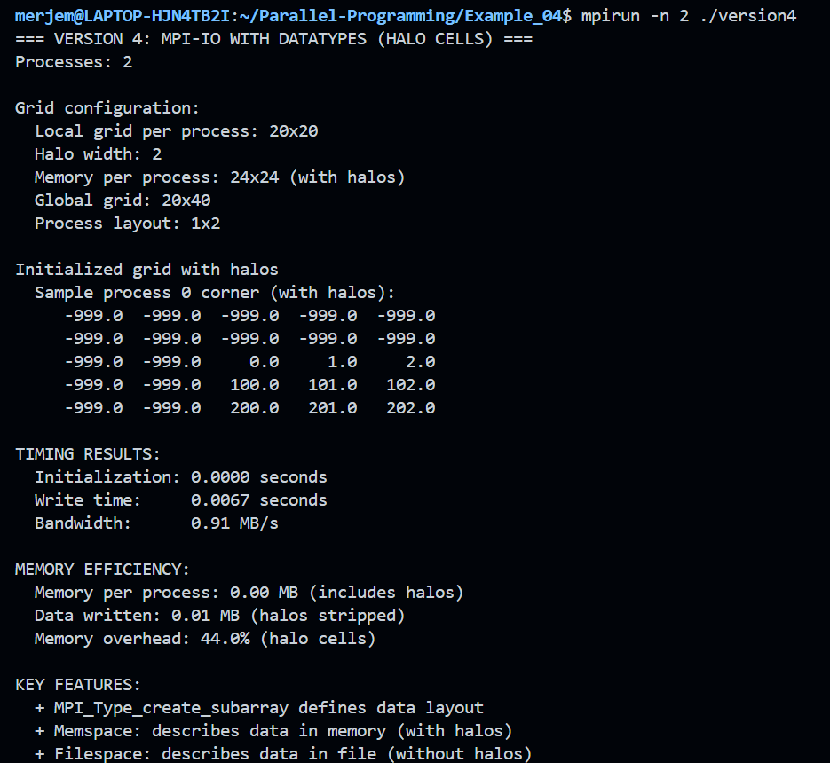
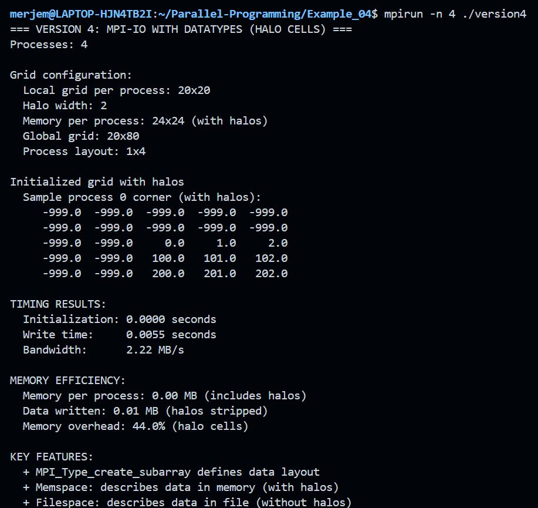

# Assignment 11

## Overview
The purpose of this assignment was to see how parallel file I/O operations work using MPI-IO. 4 different implementations were tested on a 1.1GB dataset in order to showcase the performance characteristics of serial and parallel I/O approaches. 

## Environment 
- Processor - 4-core CPU
- Dataset - 15 million records (~1.1GB CSV file)

## Dataset generation
- Generated 15 million records using the `file_generator.c` file
- File size ~1144.4 MB 

## Execution results
### Example 1 - 2 processes

- Total time: 29.04 seconds
- Read time: 27.05 seconds (which is 93% of total)
- Write time: 1.10 seconds
- Massive bottlenack present on rank 0

### Example 1 - 4 processes 

- Total time: 44.50 seconds (53% slower than 2 processees)
- Read time: 41.96 seconds (more processes, much slower)
- Serial I/O got worse with scaling 

### Example 2 - 2 processes

- Total time: 14.24 seconds (2 times faster than example 1)
- Read time: 12.68 seconds (parallel reading)
- Write time: 1.23 seconds

### Example 2 - 4 processes

- Total time: 9.18 seconds (scales properly)
- Read time: 7.75 seconds (scales w/ processes)
- Write time: 0.90 seconds
- Bandwidth: 382.56 MB/s (best among all examples)

### Example 3 - 2 processes

- Total time: 14.36 seconds
- Write time variance: 0.6664 seconds between processes
- Hints applied: `collective_buffering=true`, `aggregators=2`

### Example 3 - 4 processes

- Total time: 10.96 seconds
- Write time variance: 1.0864 seconds (increased w/ more processes)
- Hints applied: `collective_buffering=true`, `aggregators=4`

### Example 4 - 2 and 4 processes


- Small test case for scientific computing patterns
- Showcases automatic halo cell stripping w/ MPI datatypes
- Memory overhead: 44% for halo cells 

## Analysis
### 1. Main difference between executions
**Example 1 (serial I/O)**
- Only rank 0 performs all I/O OPs
- Massive memory allocation needed on rank 0 (720MB for 4 processes)
- There are network bottlenecks for scatter and gather OPs
- Performance degrades as process number increases (29s -> 45s)

**Example 2 (independent MPI-IO)**
- Independent read / write for each process 
- No scatter or gather operations
- Utilizes `MPI_File_write_at` for independent writing
- Scales very well (14s -> 9s with 2->4 processes)

**Example 3 (collective MPI-IO)**
- Similar reading strategy as in example 2
- Uses `MPI_File_write_all` for coordinated writing
- Implemented `MPI_Info` hints for optimization purposes
- Slightly slower performance than example 2

**Example 4 (datatype patterns)**
- Complex data layout commonly found in scientific computing
- Uses `MPI_Type_create_subarray` for halo cells
- Shows automatic data transformation during I/O

### 2. Execution time differences
**I/O dominates computation time**
- For example 1, we can notice that 99.8% of time was spent on I/O (27.05s read + 1.10s write vs 0.07s compute)
- For example 2, 97.8% of time was spent on I/O
- We can conclude that computation is trivial compared to I/O overhead

**Scaling behaviour**
- Example 1: negative scaling (slower due to more processes)
- Examples 2 and 3: positive scaling (this time, more processes = faster)
- Example 2 - had best overall performance

### 3. Why such drastic difference between example 1 and examples 2 and 3? 
We had 3 major bottlenecks in example 1:
1) Memory bottleneck on rank 0
- with 4 processes, 4 x 3.75M x 3 x 8 bytes = 360MB allocated 
- with 100 processes: impossible memory requirements 
- for example 2/3, each process allocates only its own chunk

2) Network congestion
- `MPI_Scatter`: data flows from rank 0 to every other one sequentially
- `MPI_Gather`: reverses flow back to rank 0
- examples 2/3 had no scatter/gather operations 

3) Serial disk access
- only rank 0 reads and writes to disk
- 999 out of 1000 processes are idle during I/O
- example 2/3: all processess access disk simultaneously 

### 4. Example 3 improvements 
```c
MPI_Info_set(*info, "collective_buffering", "true");
MPI_Info_set(*info, "cb_buffer_size", "16777216");  // 16MB buffer
MPI_Info_set(*info, "cb_nodes", cb_nodes);          // Number of aggregators
MPI_Info_set(*info, "romio_cb_write", "enable");
```
- `collective_buffering=true`: enables coordinated I/O optimization
- `cb_buffer_size=16777216`: 16MB buffer for aggregating small writes
- `cb_nodes`: Number of aggregator processes (min(nprocs, 4))
- `romio_cb_write=enable`: enables ROMIO's collective buffering

Why hints matter on parallel file systems?
- **Lustre / GPFS** for large contiguous writes
- **Aggregators** for collecting small writes from many processes into larger chunks
- **Striping** for spreading files across multiple storage targets
- **On local ext4** overhead exceeds benefits w/ few processes 

### 5. Example 2 vs Example 3 comparison
Why example 2 performs better:
1) file system difference
- local ext4 is optimized for independent operations
- parallel fs is optimized for collective operations
- example 3 hints target parallel file systems 

2) coordination overhead
- example 3 requires synchronization
- aggregators add communication overhead
- with 2 - 4 processes, overhead > benefit 

3) write time variance 
- example 3 shows some significant variance (0.67s - 1.09s)
- aggregator processes do more work
- example 2 has more uniform write times 

Example 3 would excel when:
- large clusters with 100+ processes
- parallel file systems 
- regular access patterns
- checkpointing in HPC applications 

### 6. Example 4 insights
Some key features:
- halo cell patterns - very common in stencil computations
- MPI datatypes - define complex memory / file layouts
- automatic transformation - halo cells automatically excluded during write
- memory efficiency - 44% overhead for halo communication

Real world application examples:
- climate simulations w/ boundary conditions
- fluid dynamics w/ ghost cells
- image processing w/ padding
- any computation that requires neighbour data

## Conclusion 
- Serial I/O does not scale (example 1 got worse with more processes)
- Example 2 shows 2 - 5 times performance improvement 
- Example 3 optimizations target parallel file systems
- I/O is dominating, w/ 95 - 99% of time spent on file operations
- example 4 shows MPI's power for more complex data layouts 