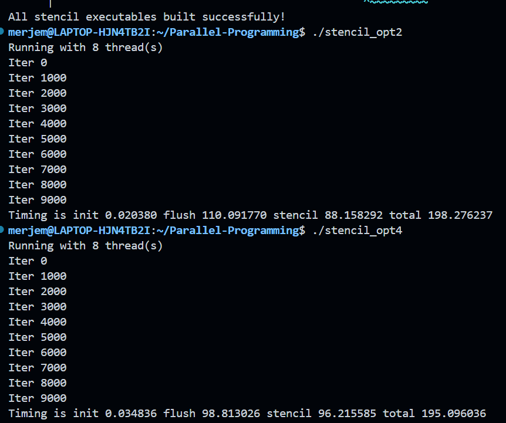
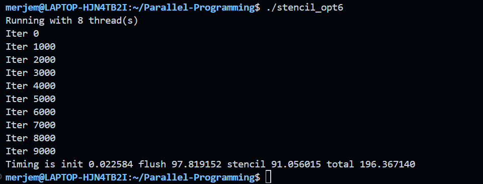

# Assignment 6

## Results
=== Stencil Performance Comparison ===
Number of CPU threads: 8

1. Base Implementation (stencil_opt2.c):
Running with 8 thread(s)
Iter 0
Iter 1000
Iter 2000
Iter 3000
Iter 4000
Iter 5000
Iter 6000
Iter 7000
Iter 8000
Iter 9000
Timing is init 0.020380 flush 110.091770 stencil 88.158292 total 198.276237

2. First Optimization (stencil_opt4.c):
Running with 8 thread(s)
Iter 0
Iter 1000
Iter 2000
Iter 3000
Iter 4000
Iter 5000
Iter 6000
Iter 7000
Iter 8000
Iter 9000
Timing is init 0.034836 flush 98.813026 stencil 96.215585 total 195.096036

3. Advanced Optimization (stencil_opt6.c):
Running with 8 thread(s)
Iter 0
Iter 1000
Iter 2000
Iter 3000
Iter 4000
Iter 5000
Iter 6000
Iter 7000
Iter 8000
Iter 9000
Timing is init 0.022584 flush 97.819152 stencil 91.056015 total 196.367140

## Terminal output 

## Implementation difference and results 
### Comparison of the three implementations
**Stencil 2 - base implementation**
- Standard loop level OpenMP
- Uses `#pragma omp parallel for` on each loop
- Overhead is present de to high thread management costs 
- Implicit barriers used after every parallel loop

**Stencil 4 - first optimization**
- Beginning of high level OpenMP
- Uses only `#pragma omp parallel` 
- Reduced the overhead and added `nowait` to flush the loop
- We are mixing implicit barriers and reduced sync 

**Stencil 6 - advances optimization**
- Full high level OpenMP
- Uses manual control
- Manual loop partitioning, explicit barriers
- Work sharking is eliminated
- Explicit barriers are used only when needed 

### Results explanation 
- Stencil 4 achieved the best overall performance as a result of reducing overhead 
- Flush loop shows consistent improvement 
. We can conclude that all the strategies we used were effective
- Stencil 6 has the best flush time and good stencil time. However, the explicit barrier overhead increased the total time slightly 
- The 1.6% improvement shows that a significant amount of time and resources were saved

## Analysis

### How many threads your CPU used to execute the code?
As we can see in the terminal output, 8 threads were used in total. This means that all 4 cores were utilized fully. 

### What are the parts of the code that were improved? What strategies were used to improve the code?
- Base (stencil 2): 198.28 seconds
- First optimization (stencil 4): 195.10 seconds (which is by 1.6% faster)
- Second, more advanced optimization (stencil 6): 196.37 seconds (1% faster than the base)

**Improvements from stencil 2 to stencil 4**
- Improved thread management and flush loop sync
- Combined `#pragma omp parallel for` into `#pragma omp parallel`
- Added `nowait` clause to flush loop. This helps with removing any unecessary barriers.
- Flush time improved from 110.09s to 98.81s, which means it is 11% faster

**Improvements from stencil 4 to stencil 6**
- Improved memory locality and work distribution 
- Implemented manual loop partitioning: used `jltb` and `jutb` instead of `#pragma omp barrier` to calculate thread specific bounds
- Used `#pragma omp barrier` only where threads needed coordination 
- Eliminated OpenMP overhead by removing automatic work sharing 
- As a result we got much better cache performance but barrier overhead was slightly increased 

### What is the difference between explicit and implicit barriers inside the code and did they exist inside any of these examples? What do they actually mean? 
**Implicit barriers**
- They were automatically added by OpenMP
- All threads have to wait there before processing 
- We can find it in stencil 2 and stencil 4 (comes right after `#pragma omp for`)

**Explicit barriers**
- They are manually inserted by using `#pragma omp barrier`
- We only use them when thread sync is important 
- Found in stencil 6 (at critical coordination points)

**Conclusion**
Implicit barriers are great, but they can cause a lot of waiting. Explicit barriers give programmers more control over the whole syncronization process. This allows us to control when threads process independently and are coordinated when needed.