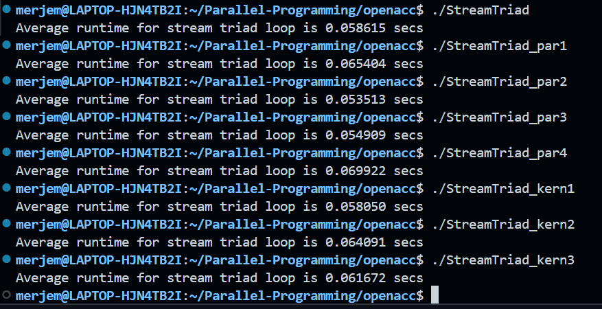
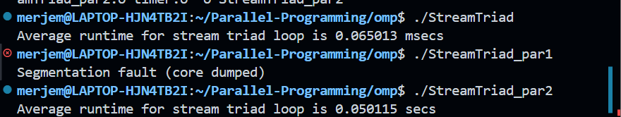
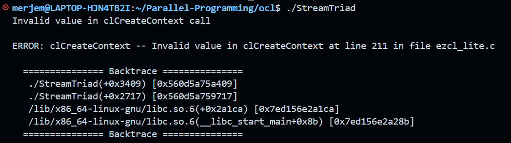
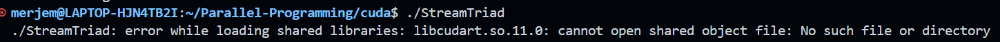
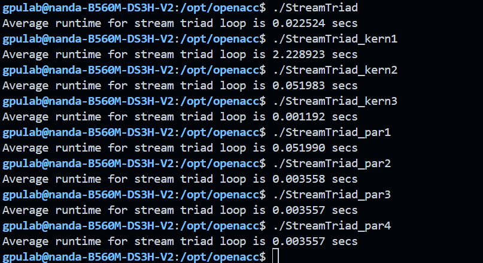

# Parallel Programming - Week 10
- We ran the stream triad benchmarks using different parallel programming models
- The goal of this lab was to measure execution times and compare them 
- We used 4 programming models: 
1) OpenACC
2) OpenMP
3) OpenCL
4) CUDA

## OpenACC results on local machine 

- As we can tell, the sequential and kernel versions have runtimes ranging from 0.05 - 0.06 seconds
- Parallel version has a similar performance (some are slightly slower due to overhead)

## OpenMP results on local machine 

- StreamTriad ran without any issues
- StreamTriad_par2 also ran successfully and shows slightly faster exeuction 
- StreamTriad_par1 crashed with a segmentation fault. 
- I analyzed the crash using gdb
``` 
(gdb) run
Program received signal SIGSEGV, Segmentation fault.
0x00005555555551bb in main at StreamTriad_par1.c:9
9          double a[nsize];

```
- The crash happened because we tried to allocate a large array on a stack
- This exceeded the WSL's default stack size
- Using `malloc` would likely fix this issue 

## OpenCL results on local machine 

- The program failed because of the ocl context creation
- This happened because ocl needs a compatible gpu / cpu
- on the wsl setup that i have, there are 2 possible reasons to why this is happening:
1) ocl cannot detect my gpu
2) the runtime is not fully supported
- this is a driver issue, not a problem with the code itself 
- running this on a proper linux machine would fix the issue


## CUDA results on local machine 

- Tried to run cuda, didnt work
- Failed because it couldnt find the cuda runtime library
- Even tho i have cuda installed (version 12) and a dedicated nvidia gpu (quattro p520)
- on a naitve linux system, this would also work without any issues 

