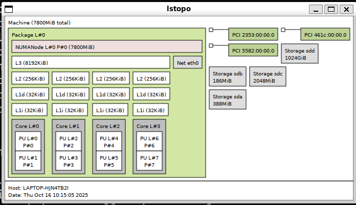
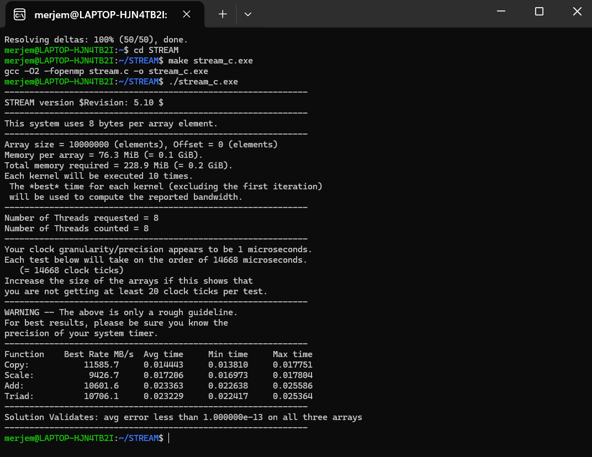
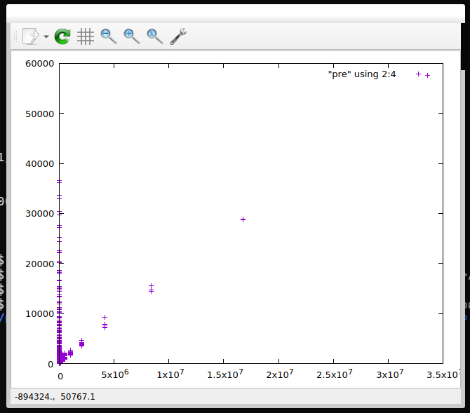
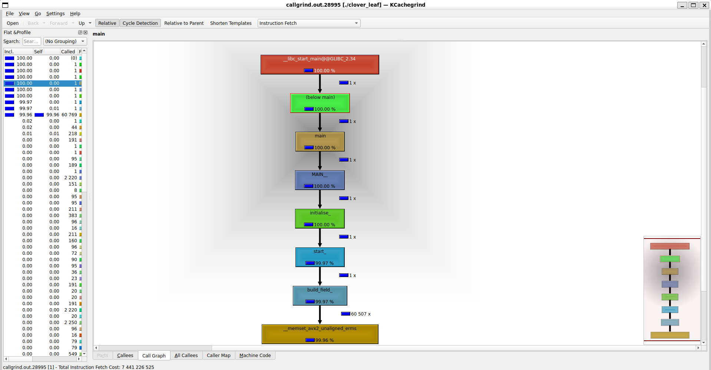
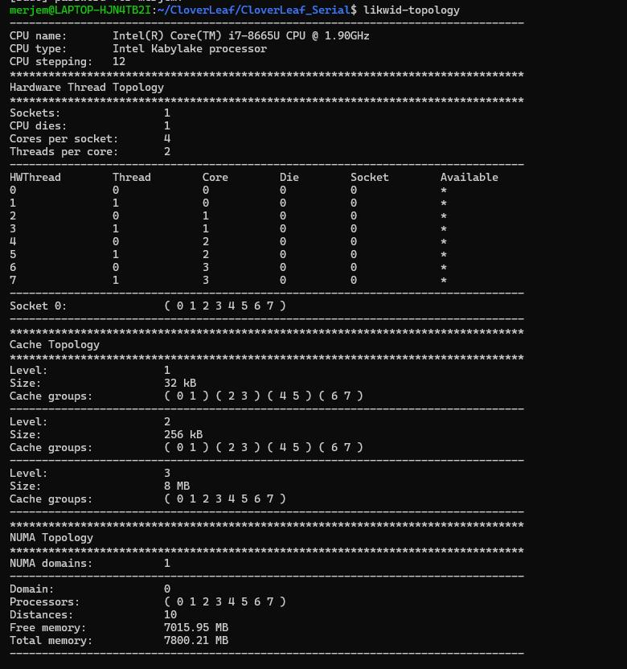
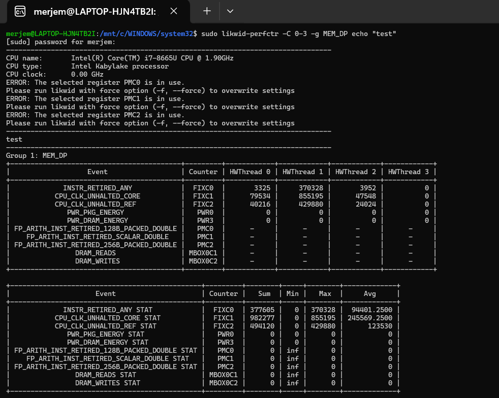
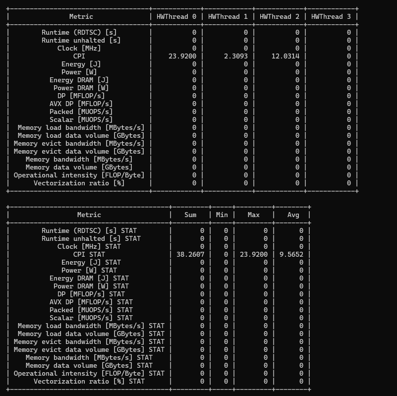
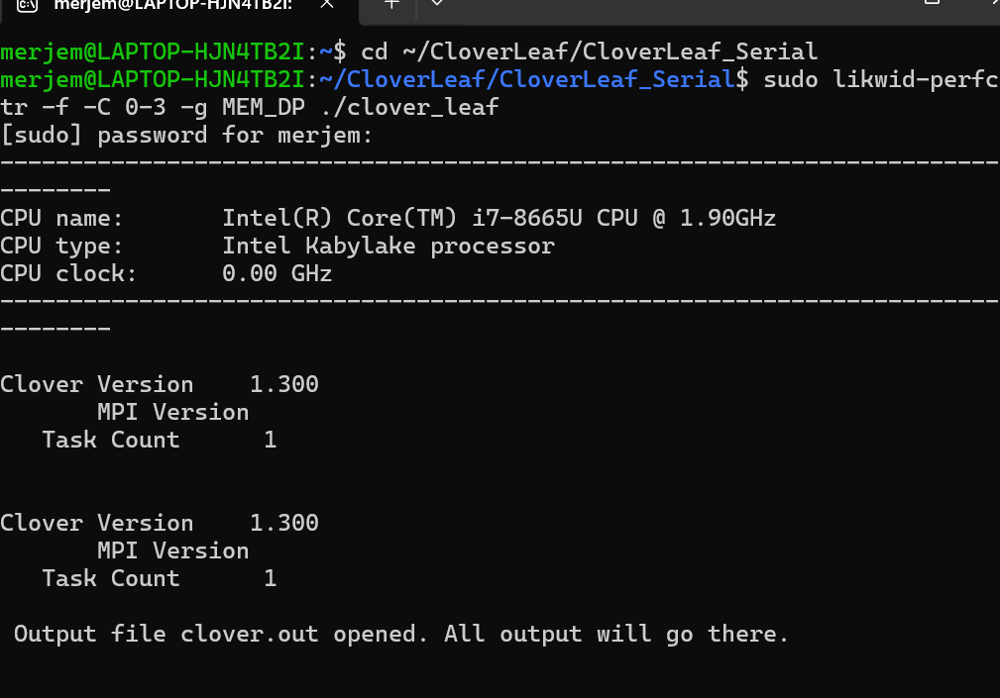
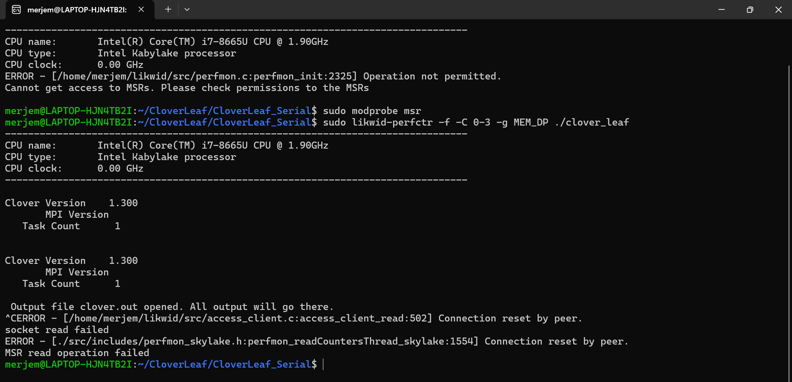

# Parallel-Programming
# Lab 3: Performance Limits and Profiling

## Examples Completed:

### ✅ Example 1: hwloc - Hardware Topology

### ✅ Example 2: STREAM - Memory Bandwidth  

### ✅ Example 3: Roofline Model

### ✅ Example 4: CloverLeaf - Profiling

### ✅ Example 5: likwid - Performance Counters

