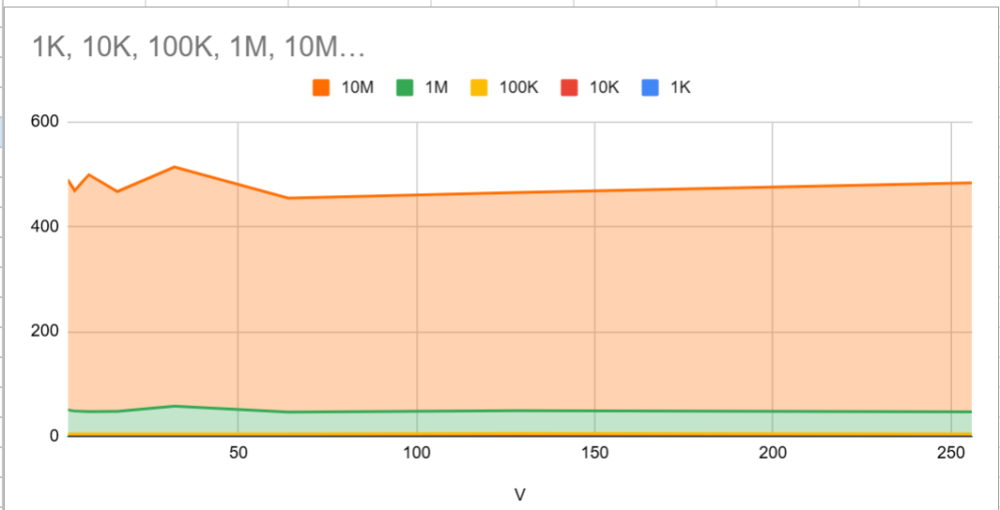

# Parallel-Programming
## PROBLEM 1: MISSING SOURCE FILE IN THE MAKEFILE
merjem@LAPTOP-HJN4TB2I:~/Parallel-Programming$ make test_1K
 Running AoSoA benchmark for N=1000
→ Building for V=2 ...
g++: fatal error: no input files
compilation terminated.
→ Running test with N=1000, V=2
/bin/sh: 1: ./aosoa_measurement_test_V2: not found
→ Building for V=4 ...
g++: fatal error: no input files
compilation terminated.
→ Running test with N=1000, V=4
/bin/sh: 1: ./aosoa_measurement_test_V4: not found
→ Building for V=8 ...
g++: fatal error: no input files
compilation terminated.
→ Running test with N=1000, V=8
/bin/sh: 1: ./aosoa_measurement_test_V8: not found
→ Building for V=16 ...
g++: fatal error: no input files
compilation terminated.
→ Running test with N=1000, V=16
/bin/sh: 1: ./aosoa_measurement_test_V16: not found
→ Building for V=32 ...
g++: fatal error: no input files
compilation terminated.
→ Running test with N=1000, V=32
/bin/sh: 1: ./aosoa_measurement_test_V32: not found
→ Building for V=64 ...
g++: fatal error: no input files
compilation terminated.
→ Running test with N=1000, V=64
/bin/sh: 1: ./aosoa_measurement_test_V64: not found
→ Building for V=128 ...
g++: fatal error: no input files
compilation terminated.
→ Running test with N=1000, V=128
/bin/sh: 1: ./aosoa_measurement_test_V128: not found
→ Building for V=256 ...
g++: fatal error: no input files
compilation terminated.
→ Running test with N=1000, V=256
/bin/sh: 1: ./aosoa_measurement_test_V256: not found
Results saved to results_N1000.csv

The target source variable was commented out in the Makefile. There was no way for the compiler to know which source file to compile. To solve the problem we simply need to uncomment and set the source target to the name of our cpp file. 

## PROBLEM 2: PROGRAM RAN WITHOUT ANY ERRORS BUT COMPUTATION TIME IS TOO SMALL

merjem@LAPTOP-HJN4TB2I:~/Parallel-Programming$ make test_1K
 Running AoSoA benchmark for N=1000
→ Building for V=2 ...
→ Running test with N=1000, V=2
→ Building for V=4 ...
→ Running test with N=1000, V=4
→ Building for V=8 ...
→ Running test with N=1000, V=8
→ Building for V=16 ...
→ Running test with N=1000, V=16
→ Building for V=32 ...
→ Running test with N=1000, V=32
→ Building for V=64 ...
→ Running test with N=1000, V=64
→ Building for V=128 ...
→ Running test with N=1000, V=128
→ Building for V=256 ...
→ Running test with N=1000, V=256
Results saved to results_N1000.csv
merjem@LAPTOP-HJN4TB2I:~/Parallel-Programming$ 

The program compiled successfully but when we check the CSV file we can see the timing is in microseconds, which is way too fast. This happened because the initialization was commented out. We can fix this by uncommenting the three rand() lines. 

## PROBLEM 3: AOSOA UNDECLARED 

merjem@LAPTOP-HJN4TB2I:~/Parallel-Programming$ make test_1K
 Running AoSoA benchmark for N=1000
→ Building for V=2 ...
aosoa_measurement.cpp: In function ‘void run_aos_aoa_kernel(long int)’:
aosoa_measurement.cpp:27:17: error: ‘AoSoA’ was not declared in this scope
   27 |                 AoSoA[j].R[i] = rand();
      |                 ^~~~~
→ Running test with N=1000, V=2
/bin/sh: 1: ./aosoa_measurement_test_V2: not found
→ Building for V=4 ...
aosoa_measurement.cpp: In function ‘void run_aos_aoa_kernel(long int)’:
aosoa_measurement.cpp:27:17: error: ‘AoSoA’ was not declared in this scope
   27 |                 AoSoA[j].R[i] = rand();
      |                 ^~~~~
→ Running test with N=1000, V=4
/bin/sh: 1: ./aosoa_measurement_test_V4: not found
→ Building for V=8 ...
aosoa_measurement.cpp: In function ‘void run_aos_aoa_kernel(long int)’:
aosoa_measurement.cpp:27:17: error: ‘AoSoA’ was not declared in this scope
   27 |                 AoSoA[j].R[i] = rand();
      |                 ^~~~~
→ Running test with N=1000, V=8
/bin/sh: 1: ./aosoa_measurement_test_V8: not found
→ Building for V=16 ...
aosoa_measurement.cpp: In function ‘void run_aos_aoa_kernel(long int)’:
aosoa_measurement.cpp:27:17: error: ‘AoSoA’ was not declared in this scope
   27 |                 AoSoA[j].R[i] = rand();
      |                 ^~~~~
→ Running test with N=1000, V=16
/bin/sh: 1: ./aosoa_measurement_test_V16: not found
→ Building for V=32 ...
aosoa_measurement.cpp: In function ‘void run_aos_aoa_kernel(long int)’:
aosoa_measurement.cpp:27:17: error: ‘AoSoA’ was not declared in this scope
   27 |                 AoSoA[j].R[i] = rand();
      |                 ^~~~~
→ Running test with N=1000, V=32
/bin/sh: 1: ./aosoa_measurement_test_V32: not found
→ Building for V=64 ...
aosoa_measurement.cpp: In function ‘void run_aos_aoa_kernel(long int)’:
aosoa_measurement.cpp:27:17: error: ‘AoSoA’ was not declared in this scope
   27 |                 AoSoA[j].R[i] = rand();
      |                 ^~~~~
→ Running test with N=1000, V=64
/bin/sh: 1: ./aosoa_measurement_test_V64: not found
→ Building for V=128 ...
aosoa_measurement.cpp: In function ‘void run_aos_aoa_kernel(long int)’:
aosoa_measurement.cpp:27:17: error: ‘AoSoA’ was not declared in this scope
   27 |                 AoSoA[j].R[i] = rand();
      |                 ^~~~~
→ Running test with N=1000, V=128
/bin/sh: 1: ./aosoa_measurement_test_V128: not found
→ Building for V=256 ...
aosoa_measurement.cpp: In function ‘void run_aos_aoa_kernel(long int)’:
aosoa_measurement.cpp:27:17: error: ‘AoSoA’ was not declared in this scope
   27 |                 AoSoA[j].R[i] = rand();
      |                 ^~~~~
→ Running test with N=1000, V=256
/bin/sh: 1: ./aosoa_measurement_test_V256: not found
Results saved to results_N1000.csv

After uncommenting the three lines of code mentioned earlier, VS Code underlines the AoSoA variable and is reporting that it is not defined. The simple fix to this is to allocate the array of SoA type structures by writing SoA_type* AoSoA = new SoA_type[num_blocks]

## PROBLEM 4: AOSOA WAS NOT DEALLOCATED
We successfully allocated the AoSoA array, but we never deallocated it. This leads to memory leaks. To prevent that, we just added the delete[] AoSoA to free memory. This did not show in the terminal but it can cause significant issues in the long run. 

## RESULTS AFTER FIXING EVERYTHING 
merjem@LAPTOP-HJN4TB2I:~/Parallel-Programming$ make test_1K
 Running AoSoA benchmark for N=1000
→ Building for V=2 ...
→ Running test with N=1000, V=2
→ Building for V=4 ...
→ Running test with N=1000, V=4
→ Building for V=8 ...
→ Running test with N=1000, V=8
→ Building for V=16 ...
→ Running test with N=1000, V=16
→ Building for V=32 ...
→ Running test with N=1000, V=32
→ Building for V=64 ...
→ Running test with N=1000, V=64
→ Building for V=128 ...
→ Running test with N=1000, V=128
→ Building for V=256 ...
→ Running test with N=1000, V=256
Results saved to results_N1000.csv
merjem@LAPTOP-HJN4TB2I:~/Parallel-Programming$ make test_10K
 Running AoSoA benchmark for N=10000
→ Building for V=2 ...
→ Running test with N=10000, V=2
→ Building for V=4 ...
→ Running test with N=10000, V=4
→ Building for V=8 ...
→ Running test with N=10000, V=8
→ Building for V=16 ...
→ Running test with N=10000, V=16
→ Building for V=32 ...
→ Running test with N=10000, V=32
→ Building for V=64 ...
→ Running test with N=10000, V=64
→ Building for V=128 ...
→ Running test with N=10000, V=128
→ Building for V=256 ...
→ Running test with N=10000, V=256
Results saved to results_N10000.csv
merjem@LAPTOP-HJN4TB2I:~/Parallel-Programming$ make test_100K
 Running AoSoA benchmark for N=100000
→ Building for V=2 ...
→ Running test with N=100000, V=2
→ Building for V=4 ...
→ Running test with N=100000, V=4
→ Building for V=8 ...
→ Running test with N=100000, V=8
→ Building for V=16 ...
→ Running test with N=100000, V=16
→ Building for V=32 ...
→ Running test with N=100000, V=32
→ Building for V=64 ...
→ Running test with N=100000, V=64
→ Building for V=128 ...
→ Running test with N=100000, V=128
→ Building for V=256 ...
→ Running test with N=100000, V=256
Results saved to results_N100000.csv
merjem@LAPTOP-HJN4TB2I:~/Parallel-Programming$ make test_1M
 Running AoSoA benchmark for N=1000000
→ Building for V=2 ...
→ Running test with N=1000000, V=2
→ Building for V=4 ...
→ Running test with N=1000000, V=4
→ Building for V=8 ...
→ Running test with N=1000000, V=8
→ Building for V=16 ...
→ Running test with N=1000000, V=16
→ Building for V=32 ...
→ Running test with N=1000000, V=32
→ Building for V=64 ...
→ Running test with N=1000000, V=64
→ Building for V=128 ...
→ Running test with N=1000000, V=128
→ Building for V=256 ...
→ Running test with N=1000000, V=256
Results saved to results_N1000000.csv
merjem@LAPTOP-HJN4TB2I:~/Parallel-Programming$ make test_10M
 Running AoSoA benchmark for N=10000000
→ Building for V=2 ...
→ Running test with N=10000000, V=2
→ Building for V=4 ...
→ Running test with N=10000000, V=4
→ Building for V=8 ...
→ Running test with N=10000000, V=8
→ Building for V=16 ...
→ Running test with N=10000000, V=16
→ Building for V=32 ...
→ Running test with N=10000000, V=32
→ Building for V=64 ...
→ Running test with N=10000000, V=64
→ Building for V=128 ...
→ Running test with N=10000000, V=128
→ Building for V=256 ...
→ Running test with N=10000000, V=256
Results saved to results_N10000000.csv

After fixing the Makefile and the cpp file, the 5 CVS files were successfully created. 

## GOOGLE SHEETS LINK
https://docs.google.com/spreadsheets/d/1upCUO9WbzWNxsB9vMPAgmfio7bcFLanXrSbLDj63zRk/edit?usp=sharing

## SCREENSHOT OF THE GRAPH

## PERFORMANCE ANALYSIS
We are going to break down performance by array size.

1K elements:
- Best performance: V32
- Worst performance: V128

10K elements:
- Best performance: V32
- Worst performance: V128

-----------------------------------

For smaller data sets like these two, smaller V values are better due to the fact that we are minimizing overhead and cache lines are being used efficiently. 

-----------------------------------

100K elements:
- Best peformance: V256 
- Worst performance: V128

-----------------------------------

For medium data sets like the one above, larger V values are at an advantage again by optimizing the cache lines and reducing overhead.

-----------------------------------

1,000,000 elements:
- Best performance: V64
- Worst performance: V32

10,000,000 elements:
- Best performance: V64
- Worst performance: V32

-----------------------------------

When it comes to these large data sets, 64V is the best cause it aligns with the 64-byte cache line size. As we know, the 64-byte cache line size is found in modern processors. 

-----------------------------------

In conclusion:
- For smaller arrays, smaller V values are better because they fit the entire cache line.
- For larger arrays, of course, larger V values are better. We can see that for 1,000,000+ elements V64 dominates (likely because that is the hardware's natural cache line size).
So the optimal data value purely depends on the size of the problem we are dealing with and the cache hierarchy. 