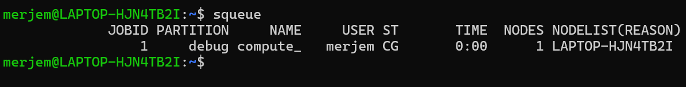
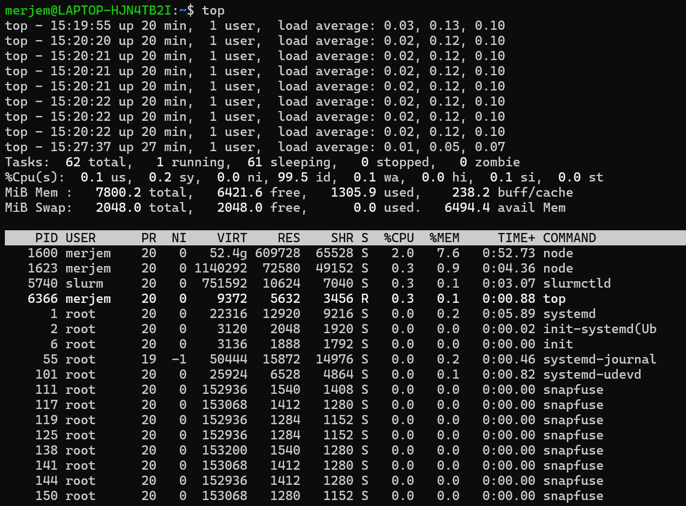

# ASSIGNMENT 10
## Update 1
- Ran the process
- It was computing for more than half an hour
- Tried to kill
- Did not work
- Tried to shut down WSL through terminal, did not work as well 

## Update 2
- when i tried to kill vmmem in task manager i got access denied 
- tried to run as admin, access denied 

## SUMMARY 
- The purpose of this lab was to see how the slurm workload manager works in a single node environment
- we configured slurm according to the lab document
- we started and enabled it 
- used sbatch and squeue for submitting and monitoring batch jobs
- observed system resource usage with top (the compute.sh clogged everything up so i couldnt test other files)
 